 

# Construcción de Sitio web F1

## Índice
- [Introducción](#Introducción)
- [Contexto](#Contexto)
- [Desarrollo](#Desarrollo)
- [Datos y Fuentes Externas](#Datos-y-Fuentes-Externas)
- [Tecnologías utilizadas](#Tecnologías-utilizadas)
- [Hosting y Deploy](#Hosting-y-Deploy)
- [Nosotros](#Nosotros)

## Introducción

En este proyecto se simula el rol de un Equipo de desarrolladores de una empresa desarrolladora a la cual la  **Federación Internacional del Automóvil(FIA)**, que es el árbitro que regula las competiciones de automovilismo más importantes, le pide el desarrollo de un sitio web para la competicion de la categoría F1.

El fin de este proyecto es generar una plataforma de información que le permita a los usuarios acercarse al deporte y más específicamente tener a disposición la información relevante más actualizada o histórica de la competencia de la fórmula 1 y su contexto. 

Se espera como producto final una plataforma con una interfaz amigable, con contenido histórico y actual de la competencia y de la categoría, de los equipos y pilotos participantes, como también formulario de contacto con la institución.

## Contexto

La Federación Internacional del Automóvil, también conocida como FIA, es una organización sin ánimo de lucro con sede en la plaza de la Concordia de París, Francia, que incluye 268 organizaciones automovilísticas de 143 países. Fundada en 1904, es mundialmente conocida por regular las competiciones de automovilismo más importantes del mundo, pero su ámbito de aplicación incluye todos los aspectos del automóvil, las carreteras, la movilidad, el medio ambiente o seguridad vial.

### Campeonato Mundial de Fórmula 1
Es la principal competición de automovilismo internacional y el campeonato de deportes de motor más popular y prestigioso del mundo. La entidad que la dirige es la Federación Internacional del Automóvil (FIA). Desde septiembre de 2016, tras la adquisición de Formula One Group, la empresa estadounidense Liberty Media es la responsable de gestionar y operar el campeonato.

A cada carrera se le denomina Gran Premio y el torneo que las agrupa es el Campeonato Mundial de Fórmula 1. La mayoría de los circuitos de carreras donde se celebran los Grandes Premios son autódromos, aunque también se utilizan circuitos callejeros y anteriormente se utilizaron circuitos ruteros. A su vez, los automóviles utilizados son monoplazas con la última tecnología disponible, siempre limitadas por un reglamento técnico; algunas mejoras que fueron desarrolladas en la Fórmula 1 terminaron siendo utilizadas en automóviles comerciales, como el freno de disco.

 
> _Gran Premio de Australia._

El inicio de la Fórmula 1 moderna se remonta al año 1950, en el que participaron escuderías como Ferrari, Alfa Romeo y Maserati. Algunas fueron reemplazadas por otras nuevas como McLaren, Williams, Red Bull y otras que volvieron como Mercedes se han alzado varias veces con el Campeonato Mundial de Constructores. Por su parte, los pilotos deben contar con la superlicencia de la FIA para competir, que se obtiene por los resultados en otros campeonatos.

## Desarrollo

Para un seguimiento INTEGRAL del desarrolo, disponibilizamos la documentacion del proyecto para su descarga [aquí](docs/DOCUMENTACION%20PROYECTO.docx)

El sitio web cuenta con 6 páginas desarrolladas con HTML (Index o página de inicio, Equipo, Calendario, Estadísticas, Galeria, Contacto)

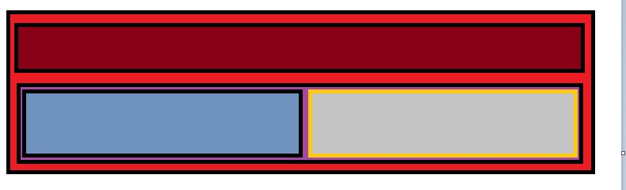
 
> _Estructura del maquetado usado en el desarrollo del sitio._

### Página de inicio (Index)

Nuestra página de inicio brinda una interfaz amigable donde predomina un encabezado de colores fuertes, con los nombres de las secciones del sitio en el comienzo.

Siguiendo el recorrido, vemos que contiene en su parte central (cuerpo de la página) distintas imagenes y capturas de noticias importantes de los eventos sobre 
la temática de la F1, y del lado derecho podemos ver que hay 2 imagenes correspondientes al ranking de posiciones en el campeonato por pilotos y por constructores
(o sea por marca lider o equipo)

Llegando al final de la página, se pueden ver de manera dinámica las escuderias que participan en el actual campeonato, en conjunto con las distintas redes sociales del
sitio web sobre F1.

Ver más

|                       |
|-----------------------|
| 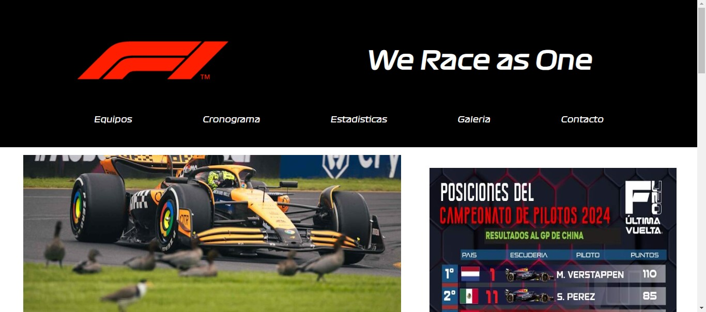 |
| Parte superior de página de inicio |

|                       |
|-----------------------|
| 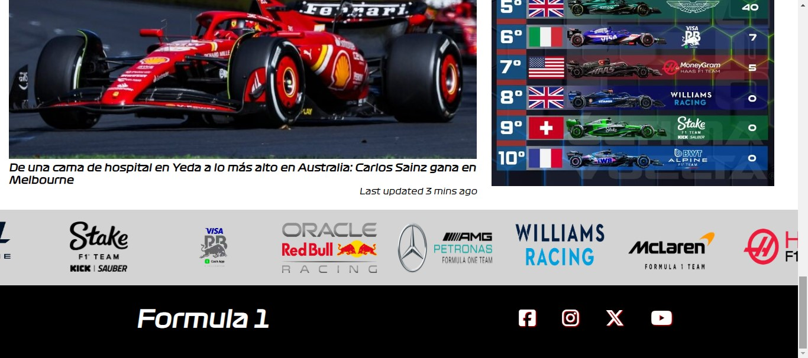 |
| Parte inferior de página de inicio |

|                       |                       |
|-----------------------|-----------------------|
| 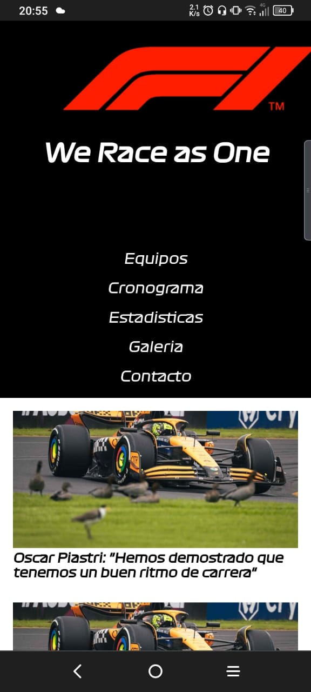 | 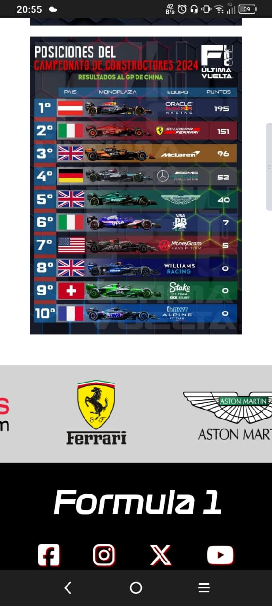 |
| Diseño responsive para celulares |

Puedes consultar el código de la página en el [script de la página](https://github.com/marco11235813/Proyecto-Codo_a_Codo/blob/main/index.html).

### Equipo

En esta seccion encontramos los equipos que participan en la categoría. Seleccionando un equipo nos lleva directamente a la seccion donde podemos ver los pilotos principales de cada equipo junto al coche correspondiente a la escuderia.

Tenemos la opcion de acceder a una reseña tanto de cada piloto como del modelo del auto con el que corren la competencia haciendo click sobre ellos.
En caso de querer regresar al inicio de la pagina donde estan los equipos para elegir, podemos hacerlo mediante el botón que se presenta del lado derecho de la pantalla con el logo de F1 en negro.

Ver más

|                       |
|-----------------------|
| 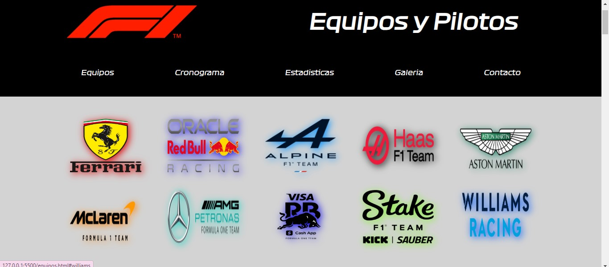 |
|Parte superior de página equipos, nos muestra las escuderías en competencia y las distintas solapas a las que podemos acceder |

|                       |
|-----------------------|
| 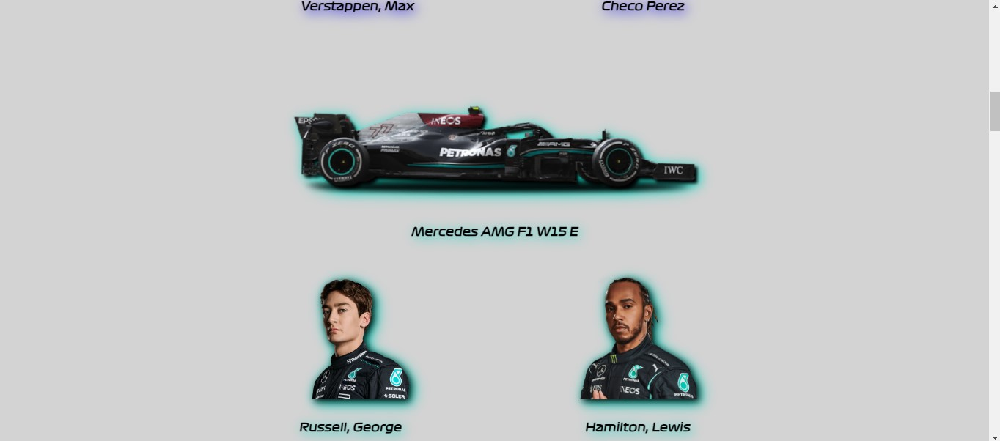 |
| Parte media de la página equipos, podemos ver el modelo de coche utilizado en la actual temporada asi como los pilotos titulares, también se observa el botón de regreso al 'índice' de escuderías |

|                       |                       |
|-----------------------|-----------------------|
|  |  |
| Modal de piloto donde se observa una reseña del mismo | Modal del coche donde se describe brevemente las características de la escudería y una breve reseña histórica |

  
Puedes consultar el código de la página en el [script de la página](https://github.com/marco11235813/Proyecto-Codo_a_Codo/blob/main/equipos.html).

### Cronograma

En esta sección encontramos la información de las fechas de cada Gran Premio de la temporada en conjunto con el circuito correspondiente,
del cual podemos ver una vista del circuito con información preliminar.

También esta disponible la posibilidad de desplegar mas información seleccinando la opcion 'más info' donde se detalla información complementaria

Ver más

|                       |
|-----------------------|
| 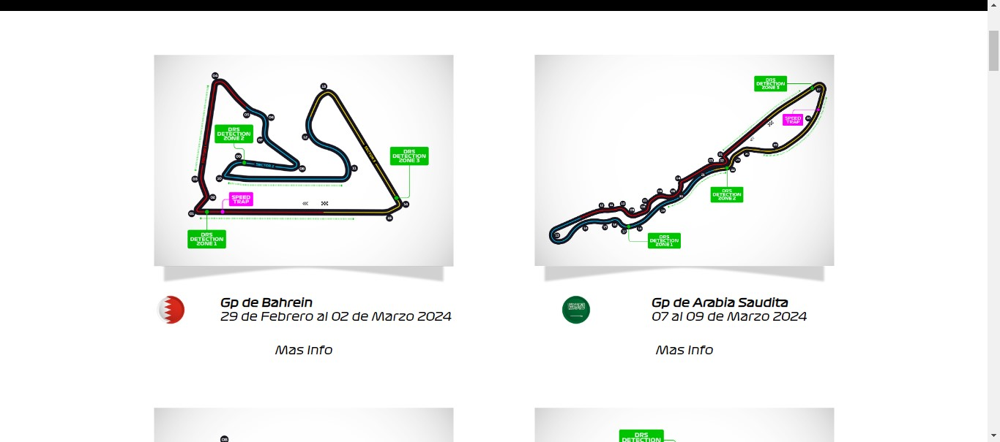 |
| Parte superior-media de la página cronograma, donde observamos algunos de los circuitos de la temporada, tanto un croquis de su disposición como fecha y lugar|

|                       |
|-----------------------|
| 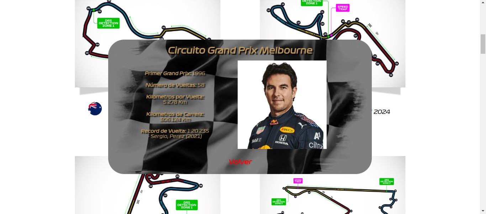 |
| Modal de circuito, se describe brevemente las caracteristicas del circuito y alguna información preliminar |

  
Puedes consultar el código de la página en el [script de la página](https://github.com/marco11235813/Proyecto-Codo_a_Codo/blob/main/calendario.html).

### Estadisticas

Próximamente :D

Ver más

  
Puedes consultar el código de la página en el [script de la página](https://github.com/marco11235813/Proyecto-Codo_a_Codo/blob/main/estadisticas.html).

### Galeria

En esta sección encontramos diferentes tomas de la temporada, en los distintos circuitos, en gradas y boxes, mostrando tanto la carrera como el despliegue de la organización, el contexto, los equipos, las diferentes secciones, las gradas y los fanáticos que van a apoyar a la escudería de su preferencia

Ver más

|                       |
|-----------------------|
| 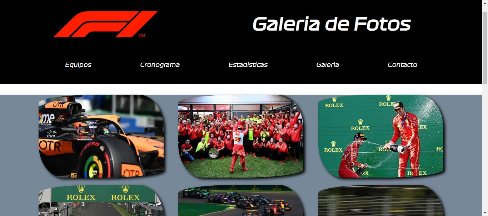 |
| Parte superior de la página galeria |

  
Puedes consultar el código de la página en el [script de la página](https://github.com/marco11235813/Proyecto-Codo_a_Codo/blob/main/galeria.html).

### Contacto

Esta sección fue creada para que el usuario tenga la posibilidad de realizar un contacto con el equipo de la FIA por interes de alguna suscripción, realizar distintas consultas, ofrecer recomendaciones sobre el sitio, y demás posibilidades.

Ver más

|                       |
|-----------------------|
| 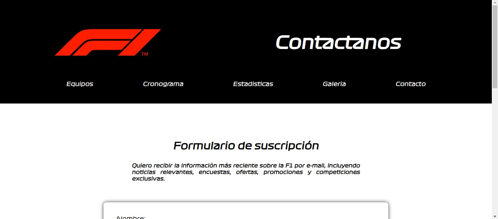 |
| Parte superior de la página contacto, se describe brevemente el formulario de contacto |

|                       |
|-----------------------|
| 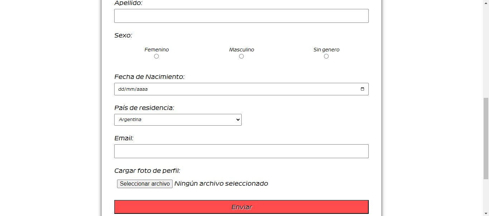 |
| Parte media-inferior de página contacto, donde se observa la disposición y campos del formulario a completar y el botón de envío |

  
Puedes consultar el código de la página en el [script de la página](https://github.com/marco11235813/Proyecto-Codo_a_Codo/blob/main/contacto.html).

## Datos y Fuentes Externas

* Fórmula 1. https://es.wikipedia.org/wiki/F%C3%B3rmula_1
* Federación Internacional del Automóvil (FIA). https://es.wikipedia.org/wiki/Federaci%C3%B3n_Internacional_del_Autom%C3%B3vil 

## Tecnologías utilizadas
Para el desarrollo de nuestro proyecto, utilizamos los siguientes lenguajes:

* 
* 
* 

Las herramientas y tecnologías utilizadas son:

* 
* 
* 

## Hosting y Deploy

Para el hosting de nuestro sitio, utilizamos el servicio de Github Pages, que esta sincronizado directamente a nuestro repositorio Github y se actualiza automaticamente
en base a los cambio que le vayamos haciendo.
Como la idea es continuar el desarrollo de nuestro sitio de manera integral (es decir, continuar el desarrollo del backend y de los aspectos que nos parezcan pertinentes y necesarios),
nos parecio lo más óptimo utilizar una funcionalidad de nuestro repositorio en un principio, aunque esto se verá supeditado a la disponibilidad de recursos para el despliegue de nuestro sitio 
por parte de la herramienta Github Pages (debemos tomar en cuenta la escalabilidad de nuestro proyecto).

Podemos ver el despliegue de nuestro sitio [aquí](https://marco11235813.github.io/Proyecto-Codo_a_Codo/)

## Nosotros

  
|      |      |      |      |
| :--: | :--: | :--: | :--: |
|  **Marco**   |  **Juan**   |  **Leandro**   |  **Lourdes**  
  

